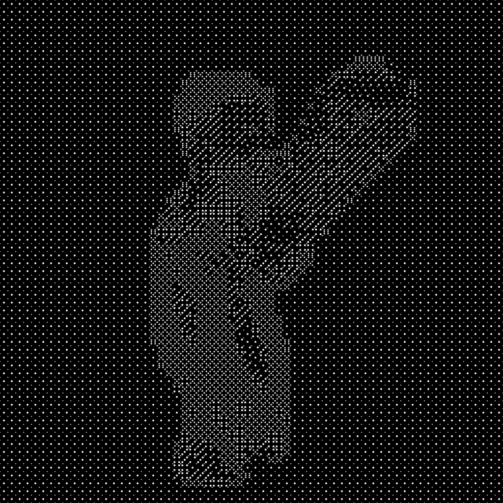

# imagen-Dado
## Explicación
Pequeño script que convierte imágenes utilizando dados.

| Imagen Normal | Imagen con Dados |
|--------------|----------------|
|  |  |

## Uso
- Clonar el repositorio ```https://github.com/brunoalbin23/imagen-Dado```
- Agregar las imagenes a procesar a la carpeta "img"
- Ejecutar ```script.py```
- EL resultado se encontrará en la carpeta "procesadas", se creará una carpeta por cada imagen ingresada donde estará la imagen aplicandole los diferentes filtros hasta llegar al resultado. En el código se puede comentar y descomentar (indicado en el código) para que esto sea diferente y solo de como resultado la imagen resultante.

> [!IMPORTANT]  
> Puede haber imagenes con mala resolución o casos especiales que no se le pueda aplicar los filtros por estos mismos problemas, en estos casos no se llegará a una imagen resultante y simplemente ingorará la imagen.
